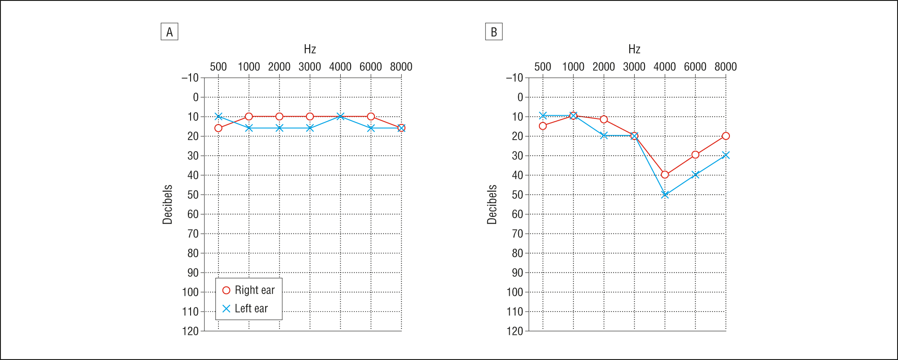
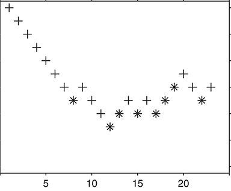

@title[Introduction]
# Hearing Loss
## A partial or complete inability to hear

---

## Costs

**Social isolation**

Image from the Noun Project, Created by Gan Khoon Lay

---

## Costs

**Loss of productivity**

<!-- TODO: details -->

---

## Costs

**Increased Risk of Dementia**

<!-- TODO: details -->

---

## Hearing Loss is becoming more common

<!-- TODO: show a graph -->

---

## Three Parts

- Hearing Assessment
- Hearing Loss                     |
- Improving Hearing - Hearing Aids |

---

# Part 1: Hearing Assessment

---

## Audiogram

---

## Adaptive Staircases

---

## Signal-detection Theory

---

## Audiometer

---

## Audiometer Calibration

---

## Loudness

---

## High-frequency Audiometery

<!-- TODO: research project -->

basic idea: hearing loss generally begins at the highest frequencies, so we miss
a lot by not measuring the higher frequencies

---

## Problem: High-frequency calibration

things that influence high-frequency sound levels at the eardrum

shape of the ear canal
insertion depth of headphone

we can account for this by playing a tone and measure the time it takes to bounce off
the ear, and then compensate for the shape for the ear canal 

## Auditory-Brainstem Response

<!-- show an image of the ABR equipment -->

---

## Auditory-Brainstem Response

<!-- show a graph of an ABR -->

---

## Auditory-Brainstem response

<!-- relate graph to different regions of the brainstem -->

---

## Otoacoustic Emissions

<!-- show an image of the equipment -->

---

## Otoacoustic Emissions

<!-- show a graph of the DPOAE -->

---

# Part 2: Hearing Loss

---

---

## Temporary Hearing Loss

**Everyday listening leads to short-term hearing loss**

<!-- TODO: show levels of sounds that will lead to a threshold shift -->

---

## Temporary Hearing Loss

**Excessive force damages hair cells

<!-- TODO: show image of ear, then cochela, then hair cells damageds -->

---

## Temporary Hearing Loss

**Damaged hairs cells lead to damaged synapses**

<!-- TODO: same image as above, but with synapses highlighted -->

---

## Temporary to Perament Loss

**Poorly understood**

<!-- TODO: question marks -->

---

## Hidden Hearing Loss

<!-- TODO: show kujawa audiograms -->

<!-- TODO: show changed suprathreshold responses -->

<!-- TODO: show changes in synaptic ribbons -->

---

## Cognitive Load

<!-- TODO: show an image describing the hypothesis -->

---

## Cognitive Load

<!-- TODO: describe pupilometry -->

---

# Part 3: Improving Hearing

