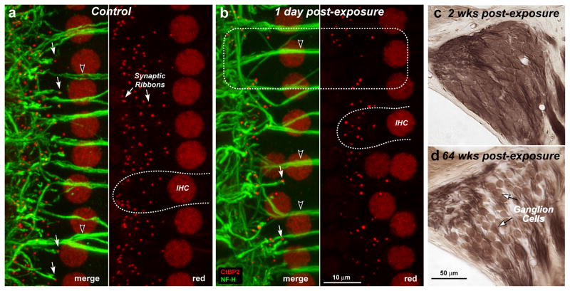

# Hearing Prosthetics

---

## Outline

Day 1
- Intro to Hearing Loss
- Hearing Prosthetics |
- Small Group Discussions: Brainstorm Solutions |
- Known challenges |

---

## Outline

Day 2
- Known challenges
- Some possible future solutions |
- Small Group Discussions: Brainstorm Solutions |
- More future solutions |

---

[With Normal Hearing](https://www.hear-it.org/sites/default/files/sound_files/Normal.mp3)

[With Hearing Loss](https://www.hear-it.org/sites/default/files/sound_files/Perceptivmiddel.mp3)

---

# Intro to Hearing Loss

---

## Costs

<images src="assets/costs%n.png" count=3/>

Images derrived from Artwork by Gan Khoon Lay and Lamik 
from the Noun Project

---

## Costs

**Hearing loss impacts a lot of people**

- 1 in 10 people have hearing loss
- >65 years: 1 in 3

---

## Audiogram

<images src="assets/audiogram%n.png" count=8/>

Note: Why would we want to use pure tones at different frequencies
to test people's hearing? (Hint: Fourier transform)

----

## Adaptive Staircase

<images src="assets/adapt%n.png" count=16/>

---

## Signal-detection Theory

<images src="assets/signal_detect%n.png" count=5/>

---

## Audiometer

<images src="assets/audiometer%n.png" count=5/>

---

# Types of Hearing Loss

---

## Conductive Hearing Loss

---

## Sensory-neural Hearing Loss

---

## Hearing Loss Causes

**Recommended levels of noise exposure**

<images src="assets/rel%n.png" count=6/>

---

## Hearing Loss Causes

**Links between hair cells can break**

<images src="assets/ear%n.png" count=2/>

---

## Hearing Loss Causes

**Links between hair cells can break**

<images src="assets/hair_cells%n.png" count=3/>

---

## Hearing Loss Causes

**Links between hair cells can break**

<images src="assets/tiplink%n.png" count=2/>

Zhao et al 1996

---

## "Temporary" Hearing Loss

**A temporary shift in threshold leads to...**

Kujawa et al 2009

---

## "Temporary" Hearing Loss

**...a permanent shift in super-threshold responses and...**

Kujawa et al 2009

---

## "Temporary" Hearing Loss

**...a permanent loss of neural tissue**

Kujawa et al 2009

Notes: TODO: add labels to graphs

---

# Hearing Prosthetics

---

## Hearing Aids

---

## Hearing Aids

Baekgaard et al 2013

Notes: TODO: show build of image

---

## Hearing Aids - Compression

Source: https://commons.wikimedia.org/wiki/File:Upward_compression.svg

- Compression is applied separately to multiple frequency bands (~12)

Notes: Why would we have separate channels of compression

---

## Hearing Aids - Effects of Noise

**Hearing aids fail in noisy environments**

[Video](https://www.youtube.com/embed/1l37lzLIgQU)

---

## OLD SLIDES

---

## Three Parts

- Hearing Assessment
- Hearing Loss           |
- Improving Hearing      |

---

# Part 1: Hearing Assessment
---

## Audiometer Calibration

<images src="assets/calibration%n.png" count=4/>

---

## Loudness

Notes: TODO: show audiogram again - talk about flat line -->

---

## Loudness

Let's try it out:
[Tone Generator](http://www.szynalski.com/tone-generator/)

---

## High-frequency Audiometery

<!-- TODO: show audiogram again - point out limit at 8kHz -->

Jungmee et al. 2011

---

## High-frequency Challenges

**Standing Waves**

---

## High-frequency Challenges

**Standing Wave-effects**

Siegel 1994

---

## Accounting for Standing Waves

**Measure distance to ear drum**

---

## Auditory-Brainstem Response

---

## Auditory-Brainstem Response

<images src="assets/abr%n.png" count=15/>

Image source: http://www.hearingfoundation.in/Images/BERA1.jpg

---

## Otoacoustic Emissions

---

## Otoacoustic Emissions

**Distortion Product Otoacoustic Emission (DPOAE)**

---

## Otoacoustic Emissions

**Outer hair cells generate sound**

---

## Summary

**We can measure pure-tone thresholds with** 

<images src="assets/puretone_summary%n.png" count=3/>

---

## Hearing in Noise

**Adjust SNR of speech vs. speech-like noise**

<images src="assets/hint%n.png" count=4/>

---

## Hearing in Noise

**Audiogram poorly predicts speech-in-noise errors**

Mead and Niquette 2000

---

## Cognitive Load

**Similar accuracy, Increased effort**

Mackersie et al 2015

---

## Summary - Part 1

<images src="assets/part1_summary%n" count=3/>

---

# Part 2: Hearing Loss

---

## Types of Hearing Loss

---

---

## "Temporary" Hearing Loss

**Temporary hair-cell damage peramanently damages synapses**

---

## High-frequency hearing loss
**Hearing loss often starts in high frequencies**

---

## Basilar Membrane Simulation

**Hearing loss often starts in high frequencies**

---

[Tinnitus Demo](https://www.soundrelief.com/tinnitus/sounds-tinnitus/)

<!-- TODO: show proposed mechanism for tinnitus??? -->

---

## Summary - Part 2

<images src="assets/part2_summary%n.png" count=4/>

---

# Part 3: Improving Hearing

---

## Loudness Recruitment

**In hearing loss, loud sounds still "feel" loud.**

Source: http://www.sens.com/helps/helps_d03.htm

---

## Compression

Source: https://commons.wikimedia.org/wiki/File:Upward_compression.svg

---

## Compression Delay

<ul>
<li class="fragment">Fast Compression - Masks speech envelope</li>
<li class="fragment">Slow Compression - Fast, loud sounds can be painful</li>

---

## Hearing aid evaluation

**Poorer cognition limits the benefits of compression**

Arehart et al 2013

---

## Speech-in-noise

**Hearing aids fail in noisy environments**

---

## Ear Machine

**User adjustable hearing aid**

Source: http://www.earmachine.com/

---

## Using eye-gaze

**Directional tuning based on eye gaze**

Kidd 2017

---

## Cochlear Implants

Source https://commons.wikimedia.org/wiki/File:Infant_with_cochlear_implant.jpg

---

## Cochlear Implants

Source https://commons.wikimedia.org/wiki/File:Cochleaimplantat.jpg

---

## Cochlear Implant Fidelity

**Cochlear implants have poor spectral resolution**

---

## Cochlear Implant Fidelity

**Cochlear implants have poor spectral resolution**
[CI Demo #2](http://www.utdallas.edu/~assmann/projects_CI.html)

---

# Auditory Rehabilitation

<!-- TODO: give an overview of perceptual learning -->
see next slide show...

---

# Summary - Part 3

<images src="assets/part3_summary%n.png" count=3/>

Images derrived from Artwork by Michael Thompson and Alena Artemova from the Noun Project

