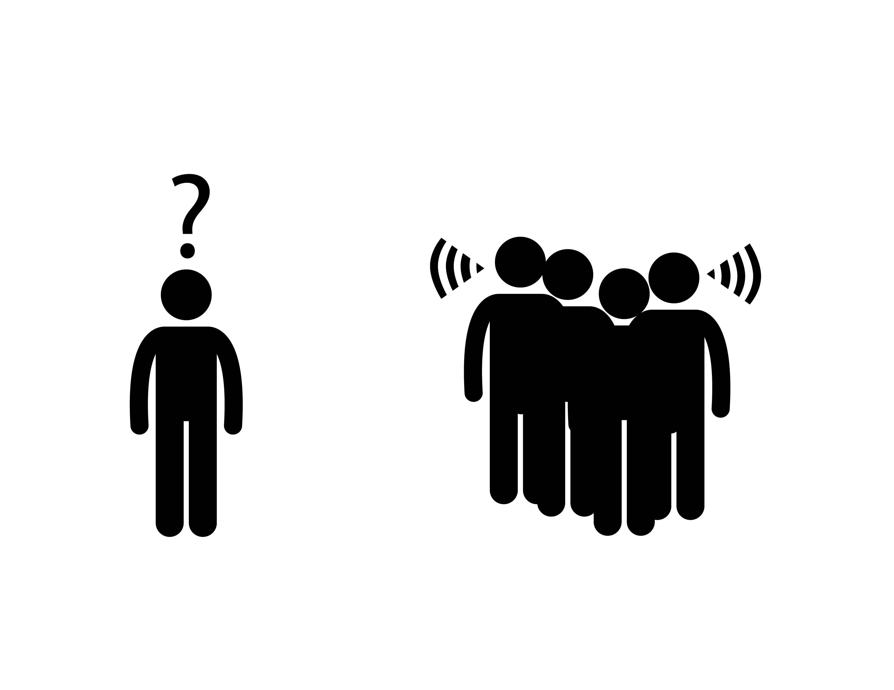

@title[Introduction]
# Hearing Loss
## A partial or complete inability to hear

---

## Costs

**Social isolation**

Image from the Noun Project, Created by Gan Khoon Lay

---

## Costs

**Loss of productivity**

<!-- TODO: details -->

---

## Costs

**Increased Risk of Dementia**

<!-- TODO: details -->

---

## Hearing Loss is becoming more common

<!-- TODO: show a graph -->

---

## Three Parts

- Hearing Assessment
- Hearing Loss                     |
- Improving Hearing - Hearing Aids |

---

# Part 1: Hearing Assessment

---

## Audiogram

<!-- TODO: show a picture of an audiogram, explain dimensions -->

---

## Adaptive Staircases

<!-- TODO: show graph of a stair case. Play some sounds as a demo -->

## Auditory-Brainstem Response

<!-- show an image of the ABR equipment -->

## Auditory-Brainstem Response

<!-- show a graph of an ABR -->

## Otoacoustic Emissions

<!-- show an image of the equipment -->

## Otoacoustic Emissions

<!-- show a graph of the DPOAE -->

---

# Part 2: Hearing Loss

---

## Hearing Loss

1. Conductive Hearing Loss
2. Sensory-neural Hearing Loss |

---

## Conductive Hearing Loss

<!-- TODO: show image of ear, and highlight ear canal and ear bones

---

## Sensory-neural Hearing Loss

<!-- TODO: show image of ear, and highlight cochlea -->

---

## Temporary Hearing Loss

**Everyday listening leads to short-term hearing loss**

<!-- TODO: show levels of sounds that will lead to a threshold shift -->

## Temporary Hearing Loss

**Excessive force damages hair cells

<!-- TODO: show image of ear, then cochela, then hair cells damageds -->

## Temporary Hearing Loss

**Damaged hairs cells lead to damaged synapses**

<!-- TODO: same image as above, but with synapses highlighted -->

## Temporary to Perament Loss

**Poorly understood**

<!-- TODO: question marks -->

## Hidden Hearing Loss

<!-- TODO: show kujawa audiograms -->

<!-- TODO: show changed suprathreshold responses -->

<!-- TODO: show changes in synaptic ribbons -->

## Cognitive Load

<!-- TODO: show an image describing the hypothesis -->

## Cognitive Load

<!-- TODO: describe pupilometry -->

---

# Part 3: Improving Hearing

