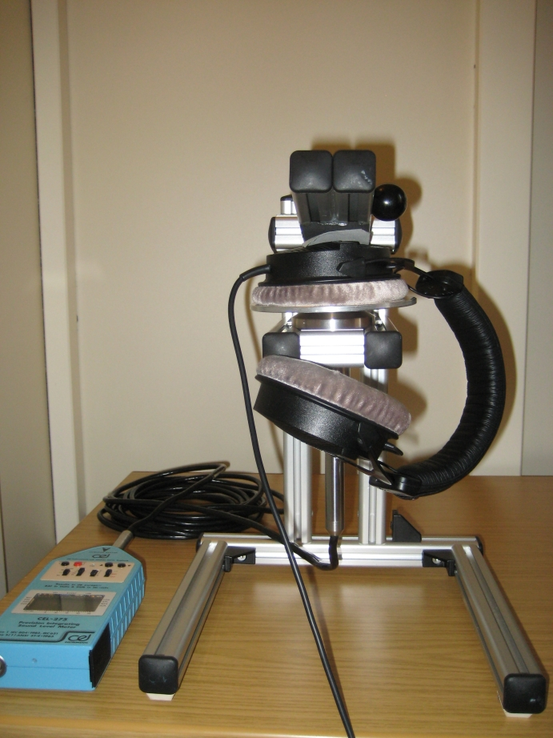
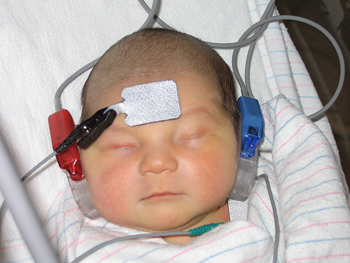
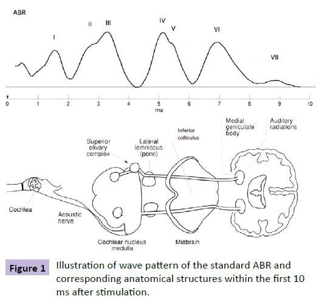
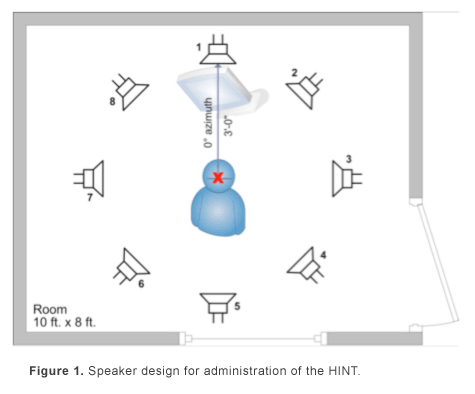
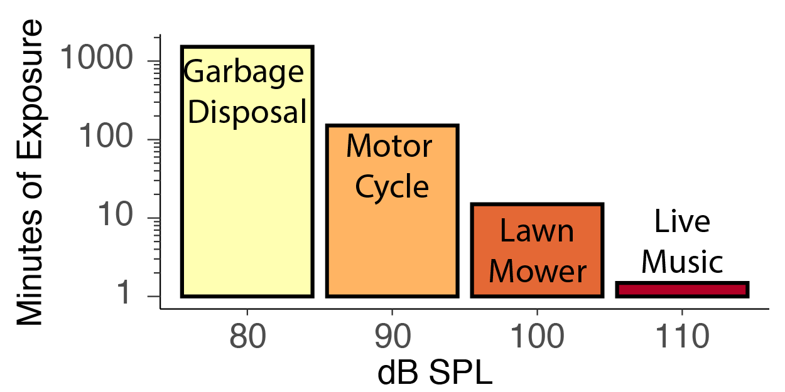
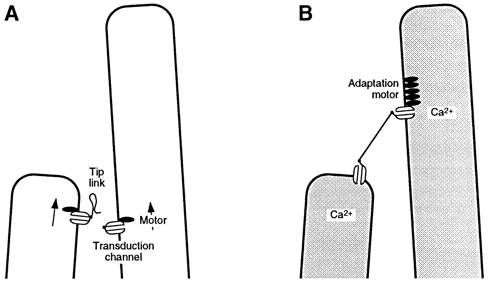

@title[Introduction]
# Hearing Loss
**A partial or complete inability to hear**

---

<!-- TODO Cite image sources -->

## Costs

Images derrived from Artwork by Gan Khoon Lay and Lamik from the Noun Project

<!-- ## Hearing loss is becoming more common -->

<!-- TODO: show a graph -->

---

## Three Parts

- Hearing Assessment
- Hearing Loss           |
- Improving Hearing      |

---

# Part 1: Hearing Assessment

---

## Audiogram

---

## Adaptive Staircase

---

## Signal-detection Theory

---

## Audiometer

---

## Audiometer Calibration

---

## Loudness

<!-- TODO: show audiogram again - talk about flat line -->

---

## Loudness

Let's try it out:
[Tone Generator](http://www.szynalski.com/tone-generator/)

---

## High-frequency Audiometery

<!-- TODO: show audiogram again - point out limit at 8kHz -->

Jungmee et al. 2011

---

## High-frequency Challenges

**Standing Waves**

---

## High-frequency Challenges

**Standing Wave-effects**

Siegel 1994

---

## Accounting for Standing Waves

**Measure distance to ear drum**

---

## Auditory-Brainstem Response

---

## Auditory-Brainstem Response

Claesdotter-Hybbinette et al 2016

---

## Otoacoustic Emissions

---

## Otoacoustic Emissions

**Distortion Product Otoacoustic Emission (DPOAE)**

---

## Otoacoustic Emissions

**Outer hair cells generate sound**

---

## Hearing in Noise

**Audiogram poorly predicts speech-in-noise errors**

Mead and Niquette 2000

---

## Hearing in Noise

**Adjust SNR of speech vs. speech-like noise**

---

## Cognitive Load

**Similar accuracy, Increased effort**

Mackersie et al 2015

---

TODO: review slide with images

---

# Part 2: Hearing Loss

---

## Types of Hearing Loss

**Conductive Hearing Loss**

## Types of Hearing Loss

**Sensory-neural Hearing Loss**

## Temporary Hearing Loss

**Recommended levels of noise exposure**

---

## Temporary Hearing Loss

**Excessive force damages hair cells**

Zhao et al 1996

---

## "Temporary" Hearing Loss

**Temporary hair-cell damage peramanently damages synapses**

---

## "Temporary" Hearing Loss

**Temporary hair-cell damage peramanently damages synapses**

---

## "Temporary" Hearing Loss

**Temporary hair-cell damage peramanently damages synapses**

---

[Hearing Loss Demo](https://www.hear-it.org/Impressions-of-hearing-loss-and-Tinnitus-)

---

## Basilar Membrane Simulation

**Hearing loss occurs at highest frequencies first**

---

[Tinnitus Demo](https://www.soundrelief.com/tinnitus/sounds-tinnitus/)

<!-- TODO: show proposed mechanism for tinnitus??? -->

---

TODO: review slide with images

---

# Part 3: Improving Hearing

---

## Hearing Aids

---

## Hearing Aid Amplification

**In hearing loss, loud sounds still "feel" loud.

Source: http://www.sens.com/helps/helps_d03.htm

---

## Compression

Source: https://commons.wikimedia.org/wiki/File:Upward_compression.svg

---

## Compression Delay

<ul>
<li class="fragment">Fast Compression - Masks speech envelope</li>
<li class="fragment">Slow Compression - Fast, loud sounds can be painful</li>

---

## Hearing aid evaluation

**Poorer cognition limits the benefits of compression**

Arehart 2013

---

## Hearing aids and Speech-in-noise

**Hearing aids fail in noisy environments**

---

## Ear Machine

**An user adjustable hearing aid**

Source: http://www.earmachine.com/

---

## Using eye-gaze

**Directional tuning based on eye gaze**

Kidd 2017

---

## Cochlear Implants

Source https://commons.wikimedia.org/wiki/File:Infant_with_cochlear_implant.jpg

---

## Cochlear Implants

---

cochlear implants (3-5 minutes):

temporal resolution vs. spectral resolution
demo of cochlear implant

## Auditory Rehabilitation

---

rehabilitation (10-12 mintues)

justify: adaptation to hearing aids, cochlear implants
late application of these devices - degredation in the signal over time
introduce perceptual learning
motivating example - training in vision restores sight acuity

show results from my 3rd experiment (1-2 minutes)

---

hair cell regeneration (read 2009 article, and createa  1-2 slide summary)

