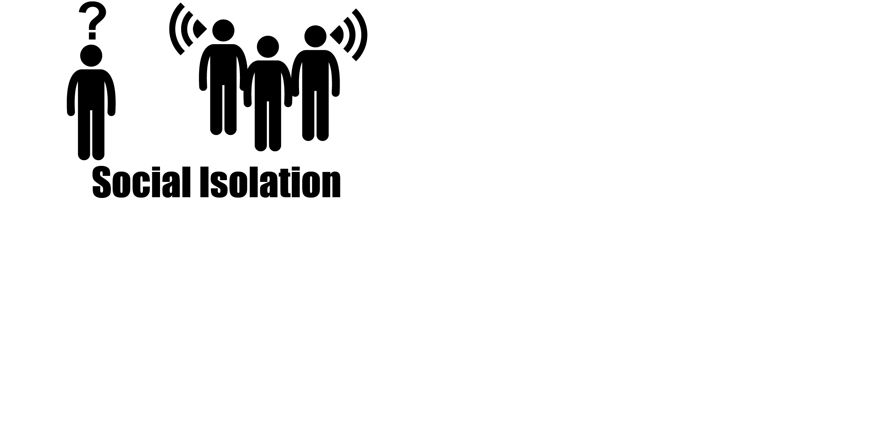
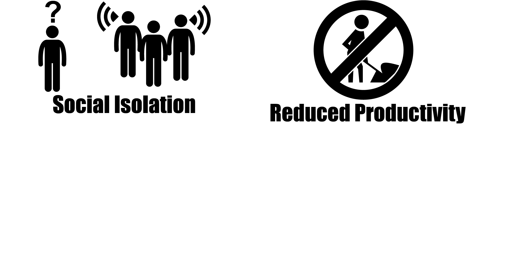
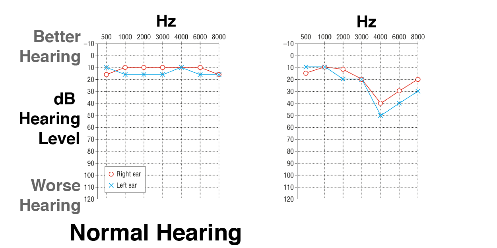
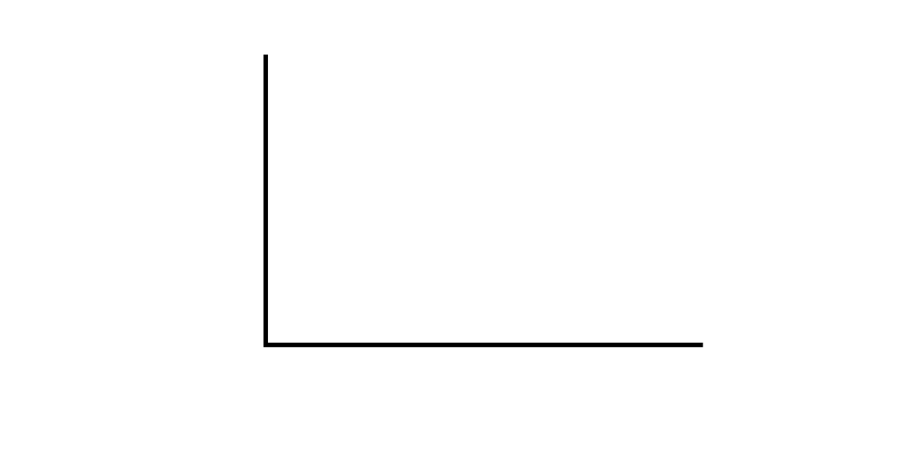

@title[Introduction]
# Hearing Loss
**A partial or complete inability to hear**

---

<!-- TODO Cite image sources -->

## Costs

Images derrived from Artwork by Gan Khoon Lay and Lamik from the Noun Project

<!-- ## Hearing loss is becoming more common -->

<!-- TODO: show a graph -->

---

## Three Parts

- Hearing Assessment
- Hearing Loss           |
- Improving Hearing      |

---

# Part 1: Hearing Assessment

---

## Audiogram

---

## Adaptive Staircases

---

## Signal-detection Theory

---

## Audiometer

---

## Audiometer Calibration

---

## Loudness

---

## High-frequency Audiometery

---

## High-frequency Challenges

**Standing Waves**

---

## High-frequency Challenges

**Standing Wave-effects**

---

## Accounting for Standing Waves

**Measure distance to ear drum**

---

## Auditory-Brainstem Response

---

## Auditory-Brainstem Response

<!-- TODO: cite below -->
<!-- http://www.openaccessjournals.com/peer-review/gender-specific-differences-in-auditory-brain-stem-response-in-young-patients-with-adhd.html
-->

---

## Otoacoustic Emissions

---

## Otoacoustic Emissions

**Distortion Product Otoacoustic Emission (DPOAE)**

---

## Otoacoustic Emissions

**Outer hair cells generate sound**

<!-- TODO: zoom from ear diagram to membrane diagram -->

---

## Hearing in Noise

**Audiogram poorly predicts speech-in-noise performance**

Mead and Niquette 2000

---

## Hearing in Noise

**Adjust SNR of speech vs. speech-like noise**

---

## Cognitive Load

**Similar accuracy, Increased effort**

---

# Part 2: Hearing Loss

---

## Temporary Hearing Loss

**Everyday listening leads to short-term hearing loss**

<!-- TODO: show levels of sounds that will lead to a threshold shift -->

---

## Temporary Hearing Loss

**Excessive force damages hair cells

<!-- TODO: show image of ear, then cochela, then hair cells damageds -->

---

## Temporary Hearing Loss

**Damaged hairs cells lead to damaged synapses**

<!-- TODO: same image as above, but with synapses highlighted -->

---

## Temporary to Perament Loss

**Poorly understood**

<!-- TODO: question marks -->

---

## Hidden Hearing Loss

<!-- TODO: show kujawa audiograms -->

<!-- TODO: show changed suprathreshold responses -->

<!-- TODO: show changes in synaptic ribbons -->

---

# Part 3: Improving Hearing

