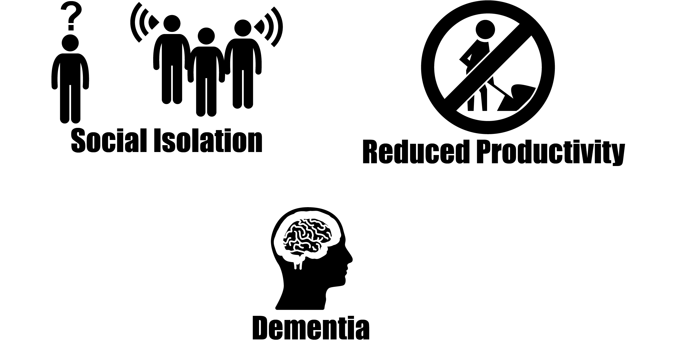
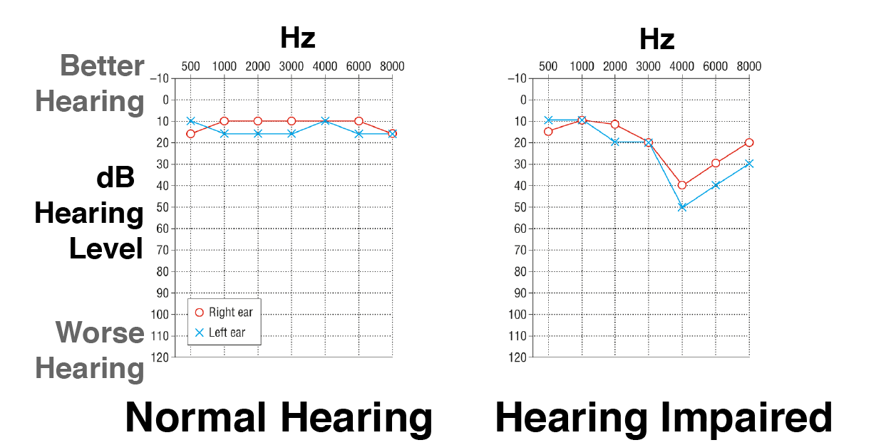
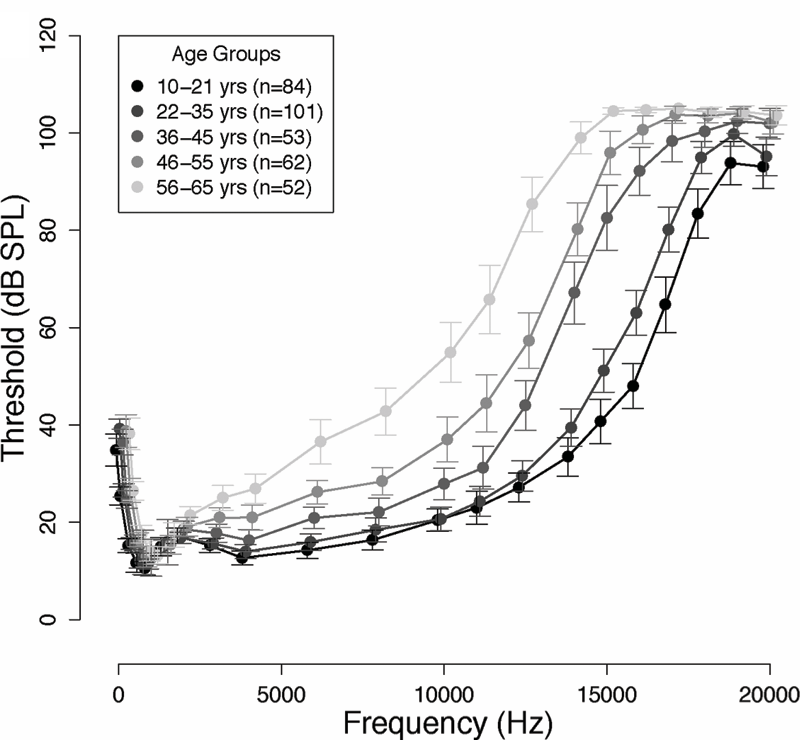

@title[Introduction]
# Hearing Loss
**A partial or complete inability to hear**

---

<!-- TODO Cite image sources -->

## Costs

Images derrived from Artwork by Gan Khoon Lay and Lamik from the Noun Project

<!-- ## Hearing loss is becoming more common -->

<!-- TODO: show a graph -->

---

## Three Parts

- Hearing Assessment
- Hearing Loss           |
- Improving Hearing      |

---

# Part 1: Hearing Assessment

---

## Audiogram

---

## Adaptive Staircase

---

## Signal-detection Theory

---

## Audiometer

---

## Audiometer Calibration

---

## Loudness

<!-- TODO: show audiogram again - talk about flat line -->

---

## Loudness

Let's try it out:
[Tone Generator](http://www.szynalski.com/tone-generator/)

---

## High-frequency Audiometery

<!-- TODO: show audiogram again - point out limit at 8kHz -->

Jungmee et al. 2011

---

## High-frequency Challenges

**Standing Waves**

---

## High-frequency Challenges

**Standing Wave-effects**

Siegel 1994

---

## Accounting for Standing Waves

**Measure distance to ear drum**

---

## Auditory-Brainstem Response

---

## Auditory-Brainstem Response

Claesdotter-Hybbinette et al 2016

---

## Otoacoustic Emissions

---

## Otoacoustic Emissions

**Distortion Product Otoacoustic Emission (DPOAE)**

---

## Otoacoustic Emissions

**Outer hair cells generate sound**

---

## Hearing in Noise

**Audiogram poorly predicts speech-in-noise errors**

Mead and Niquette 2000

---

## Hearing in Noise

**Adjust SNR of speech vs. speech-like noise**

---

## Cognitive Load

**Similar accuracy, Increased effort**

Mackersie et al 2015

---

# Part 2: Hearing Loss

---

## Temporary Hearing Loss

**Everyday listening leads to short-term hearing loss**

---

## Temporary Hearing Loss

**Excessive force damages hair cells**

Zhao et al 1996

---

## Temporary Hearing Loss

**Temporary hair-cell damage peramanently damages synapses**

---

## Temporary Hearing Loss

**Temporary hair-cell damage peramanently damages synapses**

---

## Temporary Hearing Loss

**Temporary hair-cell damage peramanently damages synapses**

---

[Hearing Loss Demo](https://www.hear-it.org/Impressions-of-hearing-loss-and-Tinnitus-)

---

[Tinnitus Demo](https://www.soundrelief.com/tinnitus/sounds-tinnitus/)

---

# Part 3: Improving Hearing

