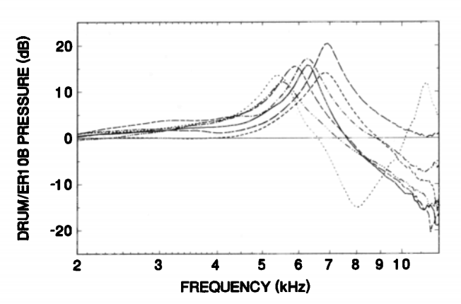

# Hearing Prosthetics

Note: Remember that I have to remove some of the slides
that I didn't actually cover on day 1 (or add them to day 2).

---

## Outline

Day 1
- Intro to Hearing Loss
- Hearing Prosthetics |
- With time: Human Hearing |

+++

## Outline

Day 2
- Review Day 1
- Human Hearing |
- Class Discussion |
- With time: Future of Prosthetics |

---

# Intro to Hearing Loss

---

## The sound of hearing loss

- Normal Hearing
<audio controls>
<source src="https://www.hear-it.org/sites/default/files/sound_files/Normal.mp3">
</audio>
- Hearing Imparied
<audio controls>
<source src="https://www.hear-it.org/sites/default/files/sound_files/Perceptivmiddel.mp3">
</audio>

Files from https://www.hear-it.org/

---

## Costs

Images derrived from Artwork by Gan Khoon Lay and Lamik 
from the Noun Project

+++

## Costs

**Hearing loss impacts a lot of people**

- 1 in 10 people have hearing loss |
- \>65 years: 1 in 3 |

---

Note: Why would we want to use pure tones at different frequencies
to test people's hearing? (Hint: Fourier transform)

+++

+++

+++

+++

## Loudness

+++

## Loudness

Let's try it out:
[Tone Generator](http://www.szynalski.com/tone-generator/)

---

# Types of Hearing Loss

---

## Conductive Hearing Loss

+++

## Sensory-neural Hearing Loss

---

## Hearing Loss Causes

+++

## Hearing Loss Causes

+++

## Hearing Loss Causes

+++

## Hearing Loss Causes

Zhao et al 1996

---

## Hidden Hearing Loss

**A temporary shift in threshold**

Kujawa et al 2009

+++

## Hidden Hearing Loss

**A permanent shift in super-threshold responses**

Kujawa et al 2009

+++

## Hidden Hearing Loss

**A permanent loss of neural tissue**

Kujawa et al 2009

---

# Hearing Prosthetics

---

## Hearing Aids

+++

## Hearing Aids

Baekgaard et al 2013

+++

## Hearing Aid Compression
- applied separately to each frequency channel (~12)

Source: https://commons.wikimedia.org/wiki/File:Upward_compression.svg

Notes: Why would we have separate channels of compression

+++

## Hearing Aids 

**Hearing aids fail in noisy environments**

<iframe width="560" height="315" src="https://www.youtube.com/embed/1l37lzLIgQU" frameborder="0" allow="accelerometer; autoplay; encrypted-media; gyroscope; picture-in-picture" allowfullscreen></iframe>

---

## Cochlear Implants

Blausen.com staff (2014). "<a class="external text" href="https://en.wikiversity.org/wiki/WikiJournal_of_Medicine/Medical_gallery_of_Blausen_Medical_2014">Medical gallery of Blausen Medical 2014</a>". WikiJournal of Medicine 1 (2). <a href="https://en.wikipedia.org/wiki/Digital_object_identifier" class="extiw" title="w:Digital object identifier">DOI</a>:<a rel="nofollow" class="external text" href="https://doi.org/10.15347/wjm/2014.010">10.15347/wjm/2014.010</a>. <a href="https://en.wikipedia.org/wiki/International_Standard_Serial_Number" class="extiw" title="en:International Standard Serial Number">ISSN</a> <a rel="nofollow" class="external text" href="https://www.worldcat.org/issn/2002-4436">2002-4436</a>. - Own work, <a href="https://creativecommons.org/licenses/by/3.0" title="Creative Commons Attribution 3.0">CC BY 3.0</a>, <a href="https://commons.wikimedia.org/w/index.php?curid=29025007">Link</a>

+++

## Cochlear Implant Fidelity

**Cochlear implants have poor spectral resolution**

<iframe width="560" height="315" src="https://www.youtube.com/embed/SpKKYBkJ9Hw" frameborder="0" allow="accelerometer; autoplay; encrypted-media; gyroscope; picture-in-picture" allowfullscreen></iframe>

+++

## Cochlear Implant Fidelity

**Cochlear implants have poor spectral resolution**

[Cochlear Implant Spectrograms](http://www.utdallas.edu/~assmann/projects_CI.html)

---

# Human Hearing

---

## Compression in the Ear

+++

## Compression in the Ear

+++

## Compression in the Ear

**Outer hair cells amplify soft sounds**

Ruggero et al 1997

+++

## Otoacoustic Emisions

**Outer hairs cells generate sound**

+++

## Otoacoustic Emissions

**Distortion Product Otoacoustic Emission (DPOAE)**

---

+++

## Binaural Cues

**Time and Ampltude Differnces**

Zhong et al 2015

+++

## Spectral Cues
**The shape of the pinna**

King 1999

+++

**Time and Ampltude Differnces**

Wolter et al 2013; Backus & Guinan 2006

+++

## Perceptual Grouping
**Grouping by frequency**

<audio src="assets/3st_aba.wav"/>
<audio src="assets/6st.wav"/>
<audio src="assets/12st.wav"/>

Data from Snyder et al 2009

+++

## Perceptual Grouping

**Grouping by temporal-coherence**

- No Foreground <audio controls>
<source src="assets/sfg1.wav">
</audio>
- With Foreground <audio controls>
<source src="assets/sfg2.wav">
</audio>

+++

## Target Enhancement

**Brain responses to attended speech is enhanced**

---

## Outline

Day 2
- Review Day 1
- More Measures of Hearing |
- Class Discussion |
- Future of Prosthetics |

---

## Summary

---

# Measures of Hearing

---

## Hearing Assement

- Audiogram
- Otoacoustic Emissions |
- Auditory Brainstem Response |
- Speech-in-Noise measures |
- Cognitive Load |

+++

## Auditory-Brainstem Response

+++

## Auditory-Brainstem Response

Image source: http://www.hearingfoundation.in/Images/BERA1.jpg

+++

## High-frequency Audiometery

<!-- TODO: show audiogram again - point out limit at 8kHz -->

Jungmee et al. 2011

+++

## High-frequency Challenges

**Standing Waves**

+++

## High-frequency Challenges

**Standing Wave-effects**

Siegel 1994

+++

## Accounting for Standing Waves

**Measure distance to ear drum**

+++

## Hearing in Noise

+++

## Hearing in Noise

**Audiogram poorly predicts speech-in-noise errors**

Mead and Niquette 2000

+++

## Cognitive Load

**Similar accuracy, Increased effort**

Mackersie et al 2015

---

## Small Group Discussions

1. Break into groups of 3-4
2. Identify 3 limitations of hearing prosthetics |
3. Describe 3 approaches to solve limitations: 3-4 bullet points each of the broad steps to design and test, with a timeline |
4. Identify problems or any gaps in knowledge with each approach. |
5. Pick a spokesperson to start sharing your ideas. |

---

## Class Discussion

1. Each group presents 1 of their ideas.
2. Class comments on each idea |
3. Any missing ideas that groups thought of are discussed. |

---

# Future Hearing Prosthetics

---

## Ear Machine

**User adjustable hearing aid**

Source: http://www.earmachine.com/

+++

Sabin et al. 2011

---

## Using eye-gaze

**Directional tuning based on eye gaze**

Kidd 2017

+++

## Using eye-gaze

**Directional tuning based on eye gaze**

Kidd 2017

---

## In-ear EEG

image By Chris Hope (https://www.flickr.com/photos/tim_uk/8135755109/)[<a href="https://creativecommons.org/licenses/by/2.0">CC BY 2.0 </a>], <a href="https://commons.wikimedia.org/wiki/File:EEG_Recording_Cap.jpg">via Wikimedia Commons</a>

+++

## In-ear EEG

Fiedler et al 2016

---
